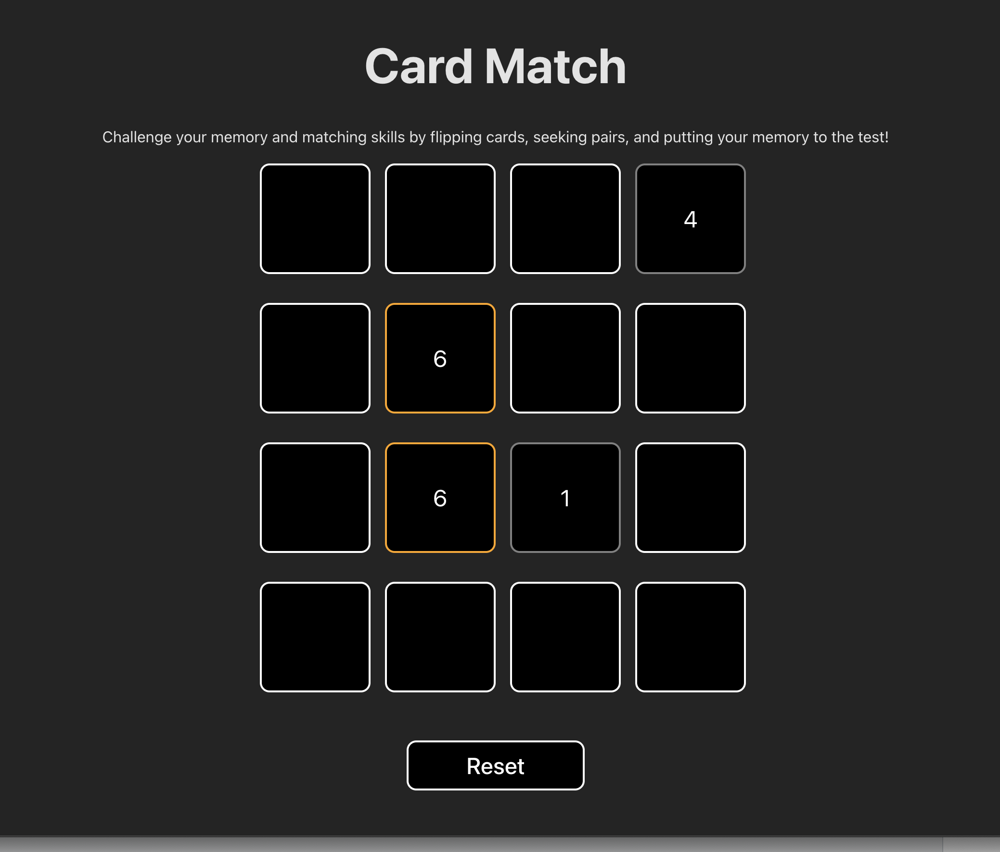

# Memory Card Matching Game

## Overview
The Memory Card Matching Game is a React-based web application designed to test memory and matching skills. Flip cards, find matching pairs, and challenge your memory in this engaging and interactive game.

## Features
- **Memory Challenge**: Exercise your memory by flipping and matching cards.
- **Pair Matching**: Find pairs by flipping cards within a limited number of moves.
- **Interactive Gameplay**: Click on cards to flip them and match pairs.
- **Confetti Celebration**: Enjoy a confetti celebration upon successfully matching all cards.

## How to Play
1. Click on a card to flip it.
2. Click on another card to find a matching pair.
3. Matching cards stay flipped; non-matching cards flip back after a short delay.
4. Match all pairs to win the game.

## Getting Started
1. **Installation**:
   - Clone the repository: `git clone https://github.com/your-username/memory-card-matching-app.git`
   - Install dependencies: `npm install`

2. **Run the Application**:
   - Start the app: `npm start`
   - Open your browser and navigate to `http://localhost:3000` to play the game.

3. **Reset the Game**:
   - Click the "Reset" button to start a new game.

## Technologies Used
- React.js
- useState and useEffect hooks
- ReactConfetti library for the celebration effect
